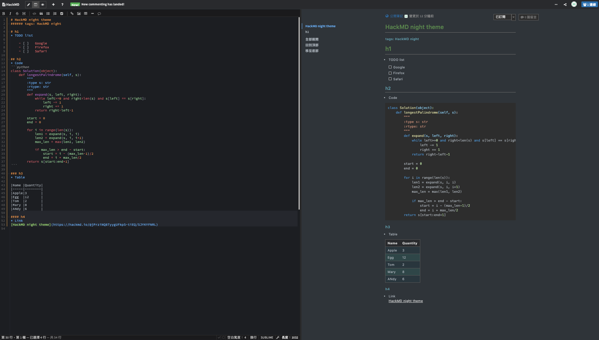

# hackmd-night-theme
* Night theme for HackMD
* Forked from: [titangene/hackmd-dark-theme](https://github.com/titangene/hackmd-dark-theme)

## Installing
Install browser extension: Stylus - get the addon for [Chrome](https://chrome.google.com/webstore/detail/stylus/clngdbkpkpeebahjckkjfobafhncgmne), [Firefox](https://addons.mozilla.org/zh-TW/firefox/addon/styl-us/) and [Opera](https://addons.opera.com/zh-tw/extensions/details/stylus/).

Then install this style using: [userstyles.org](https://userstyles.org/styles/185887/hackmd-night-theme)

## Screenshots
### Overview

